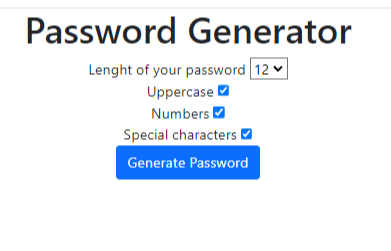

# Password Generator

## Описание проекта

"Password Generator" - это веб-приложение на Python с использованием фреймворка Django, которое позволяет пользователям генерировать пароли с различными настройками. Пользователи могут выбирать количество символов в пароле (от 6 до 12) и наличие в пароле специальных символов, цифр, а также букв в верхнем регистре.

## Функциональные возможности

- Генерация паролей длиной от 6 до 12 символов.
- Включение или исключение специальных символов.
- Включение или исключение цифр.
- Включение или исключение букв в верхнем регистре.
- Простой и интуитивно понятный интерфейс.

## Использование

1. Откройте главную страницу приложения.
2. Выберите желаемую длину пароля от 6 до 12 символов.
3. Выберите необходимые опции: включение специальных символов, цифр и букв в верхнем регистре.
4. Нажмите кнопку "Сгенерировать пароль".
5. Полученный пароль будет отображен на экране.

## Демонстрация работы

